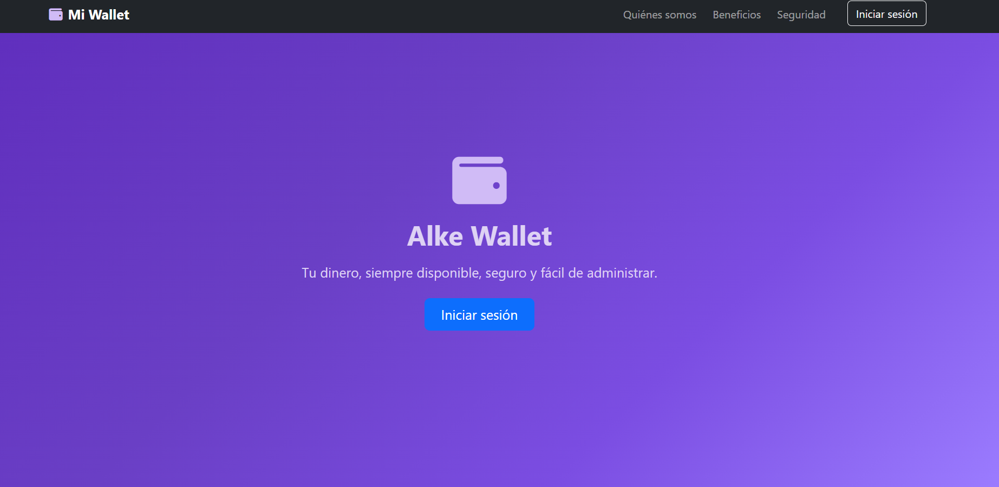
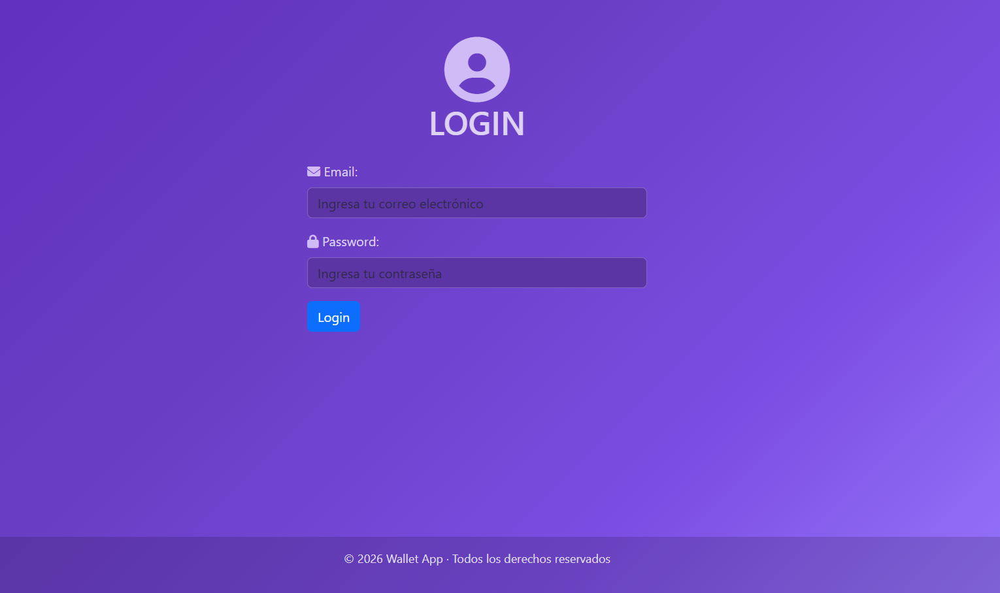
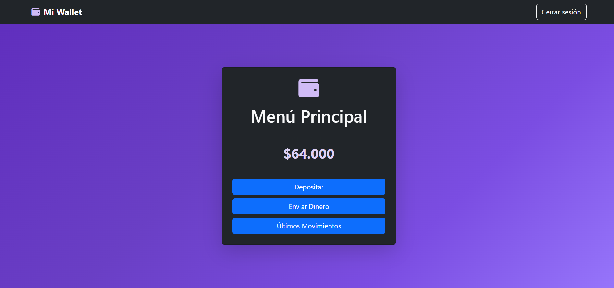
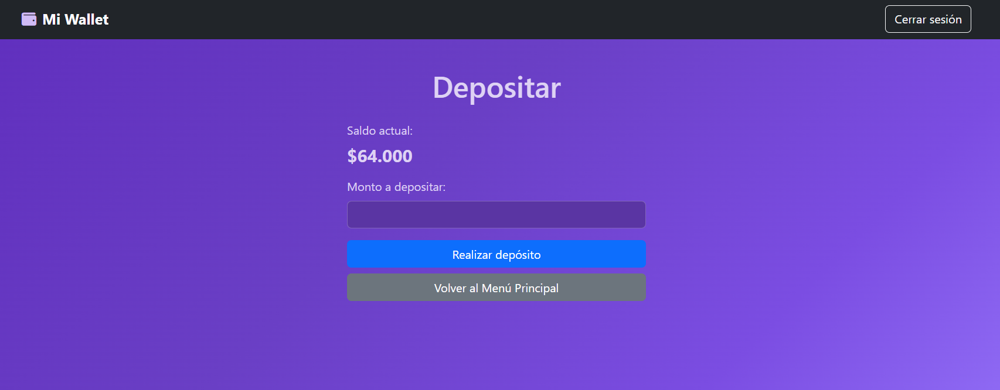
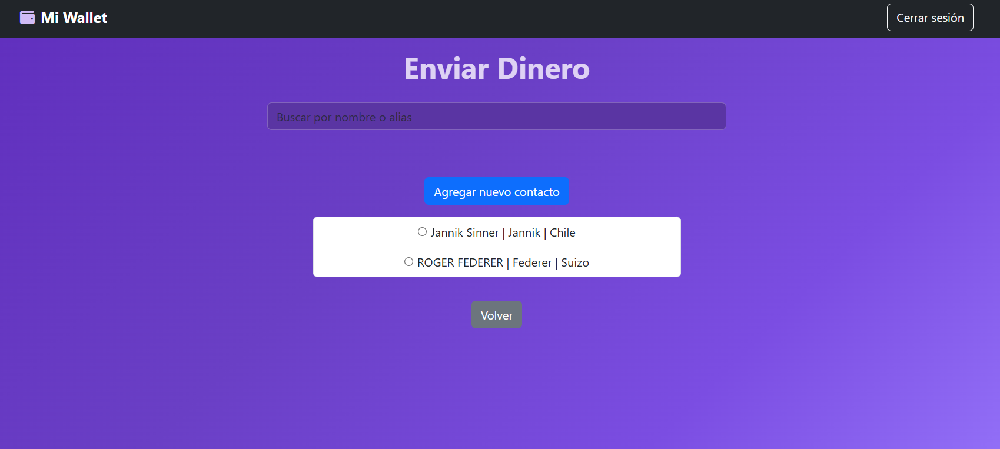

# 💳 Alke Wallet – Proyecto Módulo 2

## 📌 Descripción del proyecto
**Alke Wallet** 
Es un proyecto simula una billetera digital que permite a los usuarios gestionar su dinero de manera simple, segura e intuitiva.

La aplicación utiliza tecnologías del lado del cliente para manejar interacciones dinámicas, almacenamiento local y una interfaz visual moderna basada en Bootstrap.

---

## 🧱 Tecnologías utilizadas
- HTML5  
- CSS3  
- Bootstrap 5  
- JavaScript (ES6)  
- jQuery  
- Font Awesome  

---

## 🖥️ Estructura del proyecto y pantallas

### 🏠 Pantalla de Inicio (`index.html`) 
Presenta una introducción a la aplicación junto a secciones informativas como:
- Quiénes somos  
- Beneficios  
- Seguridad  

Incluye un navbar para navegar entre secciones y un acceso directo al login.
Cómo no hay mayor información sobré qué poner en el index, le creé esas secciones y agregué imágenes, el fondo de todas las
pantallas del proyecto es algo sencillo pero que queda bien en el proyecto. Y agregué el footer para seguir las buenas prácticas para que tenga header, main y footer. 
Para ingresar al login se puede hacer a través del botón iniciar sesión en la barra de navegación o en el botón que aparece abajo del h1.

---

### 🔐 Pantalla de Login (`login.html`)
Permite al usuario iniciar sesión mediante email y contraseña.
email: admin@mail.com
password: 1234

**Funcionalidades:**
- Validación de campos obligatorios
- Validación del formato del email
- Mensajes de éxito y error mediante alertas de Bootstrap
- Redirección automática al menú principal tras un login exitoso

> Las credenciales están simuladas en javascript para cumplir con los requerimientos.

---

### 📋 Menú Principal (`menu.html`)
Pantalla central de navegación de la aplicación.

**Permite al usuario:**
- Visualizar su saldo actual
- Acceder a las funciones:
  - Depositar dinero
  - Enviar dinero
  - Ver últimos movimientos

Utiliza Local Storage para mantener el saldo actualizado entre pantallas. 
El menú o barra de navegación tiene el botón de cerrar sesión el cuál redirige al index, simulando un cierre de sesión. Este menú también está presente en las siguientes pantallas: 
- deposit
- sendmoney
- transactions

---

### 💰 Pantalla de Depósito (`deposit.html`)
Permite agregar dinero a la cuenta del usuario.

**Características:**
- Muestra el saldo actual al cargar la página
- Validación del monto ingresado
- Actualización del saldo en Local Storage
- Registro del depósito como movimiento
- Mensaje de confirmación con Bootstrap
- Redirección automática al menú principal

---

### 💸 Pantalla de Enviar Dinero (`sendmoney.html`)
Simula el envío de dinero a contactos guardados.

**Funcionalidades:**
- Búsqueda en la agenda de contactos
- Agregar nuevos contactos
- Selección de contacto para enviar dinero
- Validación de monto y saldo disponible
- Registro de la transferencia como movimiento
- Mensajes de confirmación y error
- Al crear nuevo contacto pide CBU, por lo que averigüé el CBU (Clave Bancaria Uniforme) es exclusivo de Argentina
y SIEMPRE tiene 22 dígitos numéricos. Por lo tanto se valida que se agreguen 22 dígitos. 

---

### 📊 Pantalla de Últimos Movimientos (`transactions.html`)
Muestra el historial de transacciones del usuario.

**Características:**
- Carga dinámica de movimientos desde Local Storage
- Listado de transacciones ordenadas por fecha
- Mensaje informativo si no existen movimientos
- Base preparada para filtrar por tipo de transacción

---

## 💾 Uso de Local Storage
El proyecto utiliza Local Storage para simular persistencia de datos, guardando:
- Saldo del usuario
- Movimientos realizados (depósitos y transferencias)
- Contactos de la agenda

Esto permite mantener la información entre pantallas sin necesidad de backend.

---

## 👩‍💻 Autora
**Cintia Muñoz Valdés**  

